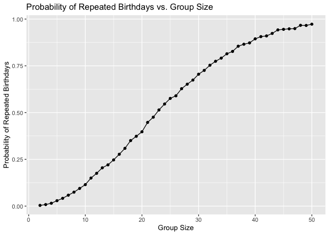
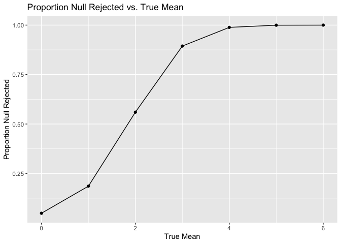
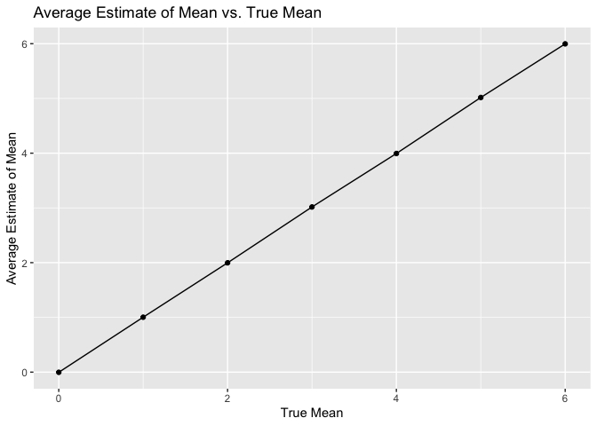

p8105_hw5_ren2121
================
2025-11-09

``` r
library(tidyverse)
```

    ## ── Attaching core tidyverse packages ──────────────────────── tidyverse 2.0.0 ──
    ## ✔ dplyr     1.1.4     ✔ readr     2.1.5
    ## ✔ forcats   1.0.0     ✔ stringr   1.5.1
    ## ✔ ggplot2   3.5.2     ✔ tibble    3.3.0
    ## ✔ lubridate 1.9.4     ✔ tidyr     1.3.1
    ## ✔ purrr     1.1.0     
    ## ── Conflicts ────────────────────────────────────────── tidyverse_conflicts() ──
    ## ✖ dplyr::filter() masks stats::filter()
    ## ✖ dplyr::lag()    masks stats::lag()
    ## ℹ Use the conflicted package (<http://conflicted.r-lib.org/>) to force all conflicts to become errors

## Problem 1

Writing a function to randomly draw birthdays and check whether
birthdays have been repeated:

``` r
bday_sim = function (n_room) {
  
  birthdays = sample(1:365, n_room, replace = TRUE) 

  repeated_bday = length(unique(birthdays)) < n_room
  
  repeated_bday
  
}

bday_sim_results =
  expand_grid(
    group_size = 2:50,
    iter = 1:10,000
  ) |> 
  mutate(
    result = map_lgl(group_size, bday_sim)
  ) |> 
  group_by(
    group_size
  ) |> 
  summarize(
    prob_repeat = mean(result)
  )
#comment! I THINK THERE'S A PROBLEM!!! it looks like 100% probability, but that can't be. I don't know how to fix this and I don't think I really understand this code.
```

Plotting the probability as a function of group size:

``` r
bday_sim_results |> 
  ggplot(aes(x = group_size, y = prob_repeat)) +
  geom_point() +
  geom_line()
```

<!-- -->

``` r
#LABEL PLOTS!!!!!
```

interpret here!!!!!!!!!!!

## Problem 2

``` r
#Writing a function

sim_ttest = function(mu){
  
  n = 30
  sigma = 5
  x = rnorm(n = n, mean = mu, sd = sigma)
 
t.test(x, mu = 0) |> 
   broom::tidy() |> 
   select(estimate, p.value)
  
}

set.seed(3) #my favorite number

power_df =
  expand_grid(
    mu_true = 1:6,
    iter = 1:5000
  )
power_results_df = 
  power_df |> 
  mutate(
    results = map(mu_true, sim_ttest)
  ) |> 
  unnest(results)
```

Plotting the proportion of times the null was rejected:

``` r
power_results_df |> 
  group_by(mu_true) |> 
  summarize(
    power = mean(p.value < 0.05)
  ) |> 
  ggplot(aes(x = mu_true, y = power)) +
    geom_point() + 
    geom_line() +
  labs(
    x = "True Mean",
    y = "Proportion Null Rejected",
    title = "Proportion Null Rejected vs. True Mean"
  )
```

<!-- -->
COMMENT ON PLOT!!!!!

Plotting the average estimate of mu versus the true mu:

``` r
power_results_df |> 
  group_by(mu_true) |> 
  summarize(
    avg_estimate = mean(estimate)
  ) |> 
  ggplot(aes(x = mu_true, y = avg_estimate)) +
    geom_point() + 
    geom_line() +
  labs(
    x = "True Mean",
    y = "Average Estimate of Mean",
    title = "Average Estimate of Mean vs. True Mean"
  )
```

<!-- -->
COMMENT ON PLOT!!!!!

Plotting the average estimate of mu versus the true mu AMONG SAMPLES FOR
WHICH NULL WAS REJECTED:

``` r
power_results_df |> 
  filter(p.value < 0.05) |> 
  group_by(mu_true) |> 
  summarize(
    avg_estimate = mean(estimate),
  ) |> 
  ggplot(aes(x = mu_true, y = avg_estimate)) +
    geom_point() + 
    geom_line() +
  labs(
    x = "True Mean",
    y = "Average Estimate of Mean",
    title = "Average Estimate of Mean vs. True Mean"
  )
```

<!-- -->
COMMENT ON PLOT!!!!! ANSWER: Is the sample average of 𝜇̂ across tests for
which the null is rejected approximately equal to the true value of 𝜇 ?
Why or why not?
